<style scoped>
section {
  background-image: url('assets/moleskine.png');
  background-size: 100% 125%;
  background-position: center;
  background-repeat: no-repeat;
  background-color: #1a2e3e;
  padding-top: 78.5px;
  justify-content: center;
}
section h1, section h2 {
  position: static;
  color: #1a2e3e;
}
h2 {
  color: #1a2e3e;
  margin-bottom: 40px;
}
section {
  padding-left: 460px;
  text-align: left;
}
</style>

# Stylus-based note-taking
## Interactive <span class="handwritten"><span style="letter-spacing:0.02em">content</span> <span style="letter-spacing:-0.01em">from</span> <span style="letter-spacing:0.04em">Ink</span></span>

Ink AI · Sundai Hack March 29

*Daniel Kiecza*

---

<style scoped>
.columns { display: flex; gap: 30px; align-items: center; margin-right: -30px; margin-left: 10px; margin-top: -50px; }
.columns .text { flex: 1; font-size: 1.5em; }
.columns .gif { flex: 0 0 auto; }
h2 { margin-bottom: 0; }
.pen-stroke-wrap { position: relative; display: block; overflow: visible; }
.columns .text { overflow: visible !important; }
.flourish {
  position: absolute;
  left: -45px;
  top: 48px;
  min-width: 460px;
  width: 460px;
  height: auto;
  overflow: visible;
}
</style>

## Ink-teractive magic

<div class="columns">
<div class="text">

Everything you see here
<span class="pen-stroke-wrap"><span class="handwritten-flat">started as pen strokes.</span></span>

</div>
<div class="gif">

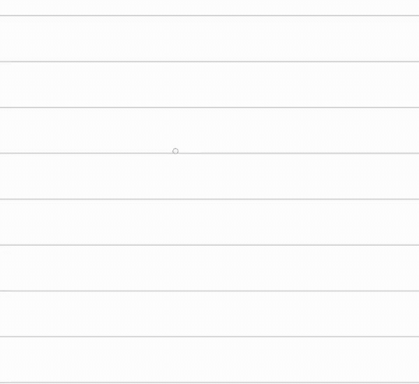

</div>
</div>

---

<style scoped>
.gif-row { display: flex; gap: 20px; margin-top: 20px; }
.gif-row .gif-col { flex: 1 1 0; text-align: center; display: flex; align-items: center; justify-content: center; }
.gif-row img { width: 100%; }
.caption-row { display: flex; gap: 20px; margin-top: 8px; }
.caption-row span { flex: 1 1 0; text-align: center; font-size: 1.1em; font-weight: bold; }
</style>

## This is not just one trick

<div class="caption-row">
<span>Shapes</span>
<span>Text and lists</span>
<span>Hangman</span>
</div>
<div class="gif-row">
<div class="gif-col">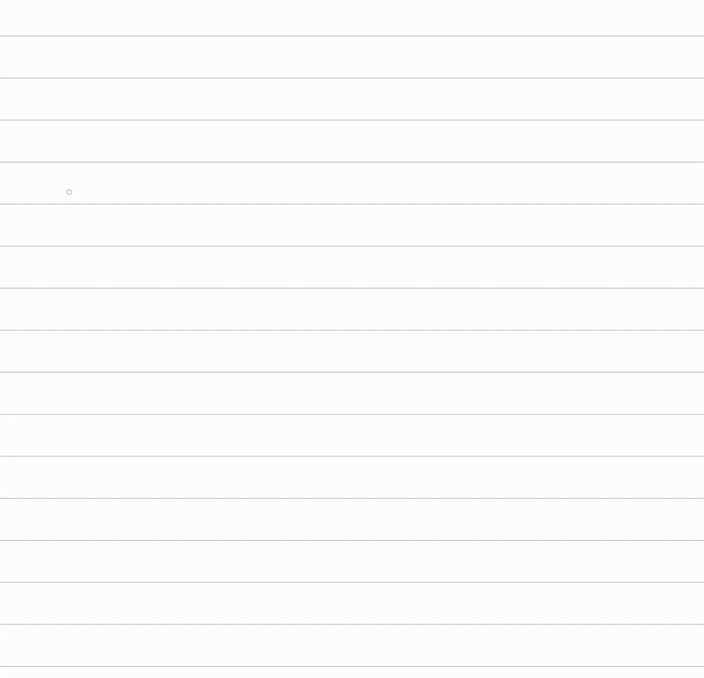</div>
<div class="gif-col">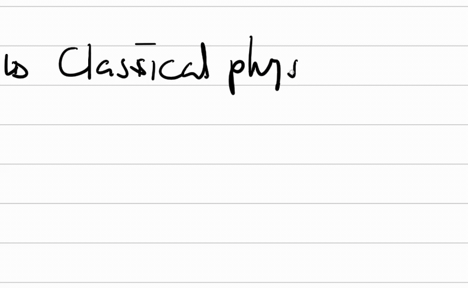</div>
<div class="gif-col">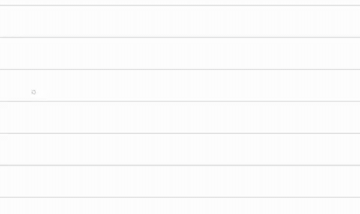</div>
</div>

---

## Live demo

<div style="display: flex; justify-content: center;">
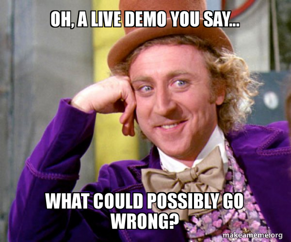
</div>

---

<!-- _class: divider -->

# How It Works

---

<style scoped>
.title-row { display: flex; gap: 40px; margin-top: 10px; margin-bottom: 5px; }
.title-row .col { flex: 1; text-align: center; font-size: 1.3em; font-weight: bold; }
.desc-row { display: flex; gap: 40px; margin-bottom: 60px; }
.desc-row .col { flex: 1; text-align: center; font-style: italic; font-size: 1.05em; }
.flow-row { display: flex; gap: 40px; }
.flow-row .col { flex: 1; }
.flow { display: flex; flex-direction: column; align-items: center; gap: 0px; font-size: 0.9em; }
.flow .arrow { font-size: 1.4em; }
.box-blue { border: 2px solid #4a90d9; border-radius: 8px; padding: 8px 20px; text-align: center; }
.box-orange { border: 2px solid #e07b39; border-radius: 8px; padding: 8px 20px; text-align: center; }
</style>

## The two main ideas

<div class="title-row">
<div class="col">Idea 1</div>
<div class="col">Idea 2</div>
</div>
<div class="desc-row">
<div class="col">Create elements from ink</div>
<div class="col">Interact with elements via ink</div>
</div>
<div class="flow-row">
<div class="col">
<div class="flow">
<div class="box-blue">✏️ Draw strokes</div>
<div class="arrow">↓</div>
<div class="box-blue">🔍 System recognizes structure</div>
<div class="arrow">↓</div>
<div class="box-blue">✨ Element becomes interactive</div>
</div>
</div>
<div class="col">
<div class="flow">
<div class="box-orange">📦 Element exists</div>
<div class="arrow">↓</div>
<div class="box-orange">✏️ Strokes drawn on it</div>
<div class="arrow">↓</div>
<div class="box-orange">⚡ Element interprets strokes</div>
</div>
</div>
</div>

---

<style scoped>
.ttt-cols { display: flex; gap: 30px; margin-top: 10px; }
.ttt-cols .col { flex: 1; text-align: center; }
.ttt-cols .col-title { font-size: 1.5em; font-weight: bold; margin-bottom: 10px; }
.ttt-cols img { height: 280px; margin-top: 10px; }
</style>

## TicTacToe: both ideas in one

<div class="ttt-cols">
<div class="col">
<div class="col-title">Creation</div>

4 strokes assessed as grid
→ element created with 9 cells

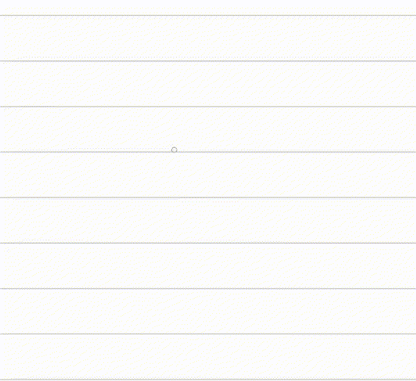

</div>
<div class="col">
<div class="col-title">Interaction</div>

Strokes over game → recognized as X || O
→ game state updates → computer responds

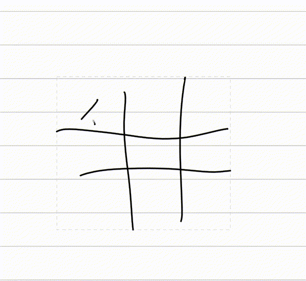

</div>
</div>

---

<style scoped>
.cols { display: flex; gap: 30px; align-items: center; }
.cols .left { flex: 1.33; font-size: 1.em; }
.cols .right { flex: 1; display: flex; justify-content: center; }
.cols .right img { max-height: 350px; max-width: 100%; }
</style>

## *Our strokes are not bitmaps*

<div class="cols">
<div class="left">

Ink content is **timestamped 2D polyline strokes**,
not a bitmap.

```typescript
interface StrokeInput {
  x: number;           // X coordinate
  y: number;           // Y coordinate
  timeMillis: number;  // Timestamp
  pressure?: number;   // 0–1, from stylus
}
```

Each stroke = ordered array of these.

</div>
<div class="right">

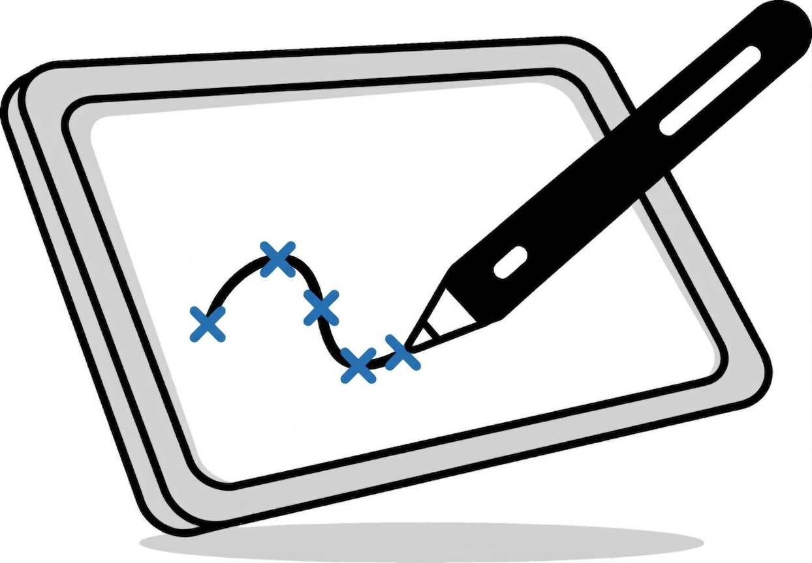

</div>
</div>

---

<style scoped>
.takeaway { margin-left: 30px; margin-top: 10px; font-weight: bold }
</style>

## Why polylines matter

<div style="font-size: 1.15em;">

- **ML training data**
  - Sequence + timing + pressure = richer signal than pixels
- **Interactivity**
  - Strokes are discrete objects you can select, move, erase, assign to elements
- **Resolution independence**
  - Renders perfectly at any zoom level
- **More efficient to store**
  - For a text-heavy meeting note, just points, no bitmaps.

<div class="takeaway">⇒ Pixels lose all of this.</div>

</div>

---

## What is an element?

A TypeScript object with a type discriminator, an id, a transform, and type-specific data.

```typescript
type Element =
  | StrokeElement
  | ShapeElement
  | GlyphElement
  | InkTextElement
  | TicTacToeElement
  | CoordinatePlaneElement
  | SketchableImageElement
  | ImageElement
  | SudokuElement
  | BridgesElement
  | MinesweeperElement
  | NonogramElement;
```

Every element in the system is one of these. You'll add yours to this union.

---

<style scoped>
.content { font-size: 0.8em }
</style>

## The `Element` plugin interface

<div class="content">

```typescript
interface ElementPlugin<T extends Element> {
  readonly elementType: string;
  readonly name: string;

  /* Creation */
  canCreate?(strokes: Stroke[]): boolean;
  createFromInk?(strokes, context, recognition?): Promise<CreationResult | null>;

  /* Interaction */
  readonly triesEagerInteractions?: boolean;  // bypass debounce (tap games)
  isInterestedIn?(element: T, strokes, strokeBounds): boolean;
  acceptInk?(element: T, strokes, recognition?): Promise<InteractionResult>;

  /* Handle-based Interaction */
  getHandles?(element: T): HandleDescriptor[];
  onHandleDrag?(element: T, handleId, phase, point): T;

  /* Rendering */
  render(ctx: CanvasRenderingContext2D, element: T, options?): void;
  getBounds(element: T): BoundingBox | null;
}
```

</div>

---

## Creation: how TicTacToe detects a grid

```typescript
function canCreate(strokes: Stroke[]): boolean {
  if (strokes.length !== 4) return false;
  const { valid } = validateBounds(strokes); // board not too small or too large
  return valid;
}
```

`createFromInk()` then:
1. Classifies each stroke as horizontal or vertical
2. Finds 4 intersection points from 2H + 2V lines
3. Constructs 9 cell quads from the intersections
4. Optionally confirms via handwriting recognition API (looks like "#")

---

## Rendering: drawing the board

```typescript
render(ctx: CanvasRenderingContext2D, element: TicTacToeElement) {
  /* Draw grid lines from stored stroke paths */
  drawGridStrokes(ctx, element.gridStrokes);

  /* Draw X and O marks with animation */
  for (const cell of element.cells) {
    if (cell.piece === 'X') drawAnimatedX(ctx, cell, progress);
    if (cell.piece === 'O') drawAnimatedO(ctx, cell, progress);
  }

  /* Draw win line if game is over */
  if (element.winLine) drawWinLine(ctx, element.winLine);
}
```

Standard Canvas 2D API — `beginPath()`, `moveTo()`, `stroke()`.

---

## Interaction: playing the game

```typescript
function isInterestedIn(element, strokes, strokeBounds): boolean {
  /* Is this stroke inside my bounding box? */
  return boundsOverlap(getBounds(element), strokeBounds);
}

async function acceptInk(element, strokes, recognition?) {
  const cellIndex = findCellForStrokes(element, strokes);
  const piece = await recognizePiece(strokes, recognition);
  const newCells = placePiece(element.cells, cellIndex, piece);
  const cpuMove = computerMove(newCells, cpuPiece, humanPiece);
  return { updatedElement: { ...element, cells: newCells } };
}
```

Strokes become game moves. The computer responds automatically.

---

<!-- _class: divider -->

# Getting Started

---

<style scoped>
.cols { display: flex; gap: 30px; align-items: center; position: relative; }
.cols .left { flex: 1.33; font-size: 0.8em}
.cols .right { flex: 1; display: flex; justify-content: center; }
.cols .right img { max-height: 500px; max-width: 100%; }
.path2-arrow {
  position: absolute;
  left: 32%;
  top: 41%;
  width: 250px;
  height: 30px;
}
</style>

## Element creation paths

<div class="cols">
<div class="left">

**Path 1: Direct structure interpretation**
- TicTacToe detects # grid from 4 line strokes
- Leverage `canCreate()` API function
- More work, but enables natural creation

**Path 2: Rectangle-with-X catalog**
- Draw a rectangle → cross it with an X → pick from a menu
- Just: `render()` + `acceptInk()`
- **Easier for hack project**

Both coexist — start with catalog, structure interpretation later.

</div>

<div class="right">

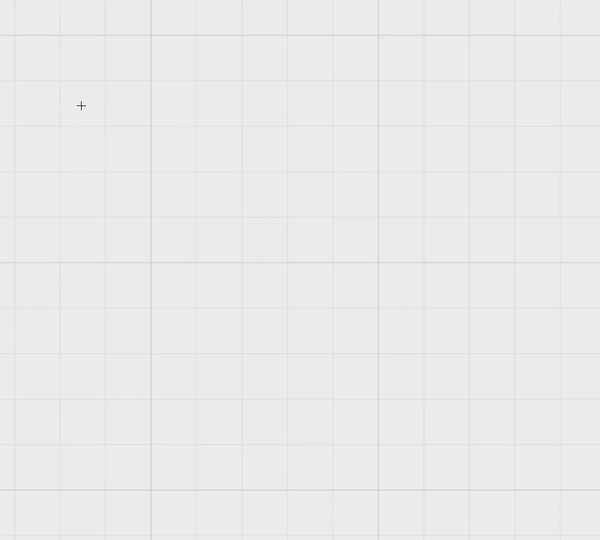

</div>
</div>

---

<style scoped>
.content { font-size: 0.79em }
</style>

## Vision models for Ink (via OpenRouter)

<div class="content">

Rasterize strokes to image → send to vision model → get structured output.

**We provide an API key** — set `OPENROUTER_API_KEY` in your `.env`.

```typescript
import { OpenRouter } from '@openrouter/sdk';
const client = new OpenRouter({ apiKey: import.meta.env.OPENROUTER_API_KEY });

const response = await client.chat.send({
  model: 'google/gemini-2.5-flash',
  messages: [{ role: 'user', content: [
    { type: 'text', text: 'Identify the drawn shapes.' },
    { type: 'image_url', image_url: { url: rasterizedDataUrl } },
  ]}],
  responseFormat: { type: 'json_schema', jsonSchema: {
    name: 'shapes', strict: true,
    schema: { type: 'object', additionalProperties: false,
      properties: { shapes: { type: 'array', items: { type: 'string' } } },
      required: ['shapes'] },
  }},
});
const { shapes } = JSON.parse(response.choices[0].message.content);
```

Good models: **Gemini Flash** (fast, cheap), **DeepSeek OCR** (structured content).

</div>

---

## Google handwriting recognition API for text

Provided via our backend proxy — **no API key needed**.

```typescript
/* Input you send */
strokes: [
  { points: [{ x: 100, y: 50, t: 0 }, { x: 150, y: 55, t: 16 }, ...] },
  { points: [{ x: 200, y: 48, t: 300 }, ...] }
]

/* Output you get back */
{
  rawText: "hello",
  lines: [{
    tokens: [{ text: "hello", boundingBox: { left: 95, top: 40, right: 255, bottom: 70 } }]
  }]
}
```

In code: `recognitionService.recognizeGoogle(strokes)` — it's wrapped for you.

---

<style scoped>
.cols { display: flex; gap: 30px; align-items: center; }
.cols .left { flex: 1; font-size: 1.3em; }
.cols .right { flex: 1; display: flex; justify-content: center; }
.cols .right img { max-height: 600px; max-width: 100%; }
</style>

## fal.ai sketch refinement (BYOK)

<div class="cols">
<div class="left">

Draw a rough sketch 
→ AI generates a refined image 
→ keep iterating.

The `SketchableImage` element uses this for AI-powered drawing assistance.

*Bring your own fal.ai API key.*

</div>
<div class="right">

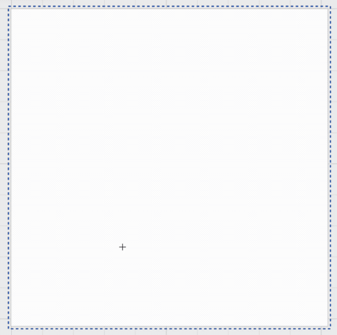

</div>
</div>

---

## The repo

```
ink-ai-hack-playground/
├── src/
│   ├── elements/          ← where you build
│   │   ├── registry/      ← plugin interface + registry
│   │   ├── tictactoe/     ← full example to study
│   │   └── ...
│   ├── types/             ← data models (elements, strokes)
│   └── recognition/       ← HW API integration
└── docs/
    └── New element HOWTO.md  ← step-by-step guide
```

```bash
git clone https://github.com/note-ai-inc/ink-ai-hack-playground.git
cd ink-ai-hack-playground
cp .env.example .env.local
# set these in .env.local:
# INK_RECOGNITION_API_URL=https://strokes.hack.ink.ai
# INK_OPENROUTER_API_KEY=sk-or-v1-your-key-here
npm install && npm run dev
```

---

## Dev flow

- **Hot reload** — save → see changes instantly
- **Mouse input works** — stylus is better but not required for development
- **Tablet testing** — use a real tablet for stylus input
  - Install `adb`
  - `adb reverse tcp:5174 tcp:5174`
  - Browse to `localhost:5174` on the tablet
- **HOWTO doc** — `docs/New element HOWTO.md` walks through every step:
  1. Define your element type
  2. Create plugin directory (renderer, creator, interaction)
  3. Register with one import line — no dispatch logic changes needed
- This is a prototype — expect rough edges, no test coverage

---

<!-- _class: divider -->

# What Will You Build?

---

<style scoped>
.cols { display: flex; gap: 30px; align-items: center; }
.cols .left { flex: 1.33; font-size: 0.9em }
.cols .right { flex: 1; display: flex; justify-content: center; }
.cols .right img { max-height: 500px; max-width: 100%; }
</style>

## Hack ideas: games

<div class="cols">
<div class="left">

- **Wordle**
  Write 5-letter guesses, color-coded feedback
- **Spelling Bee**
  7 letters in a honeycomb, find all valid words
- **Dots and Boxes**
  Draw lines between dots, claim squares
- **Gomoku** 
  Five-in-a-row on a grid, simple to implement

Build on HW reco + grid/cell mechanics.

</div>
<div class="right">


</div>
</div>

---

<style scoped>
.cols { display: flex; gap: 30px; align-items: center; }
.cols .left { flex: 2; font-size: 0.9em }
.cols .right { flex: 1; display: flex; justify-content: center; }
.cols .right img { max-height: 500px; max-width: 100%; }
</style>

## Hack ideas: data visualization & productivity

<div class="cols">
<div class="left">

- **Bar / line / pie charts**
  Sketch charts; generate clean, editable visualizations
- **Structured tables**
  Draw rough table; convert into structured data
- **Gantt timeline**
  Draw timeline; auto-generate project plan or calendar
- **Dynamic templates**
  Create dashboard: journal+calendar+to-dos+meeting snippets
- **Forms to surveys**
  Draw form layout; generate functional fillable survey

</div>
<div class="right">

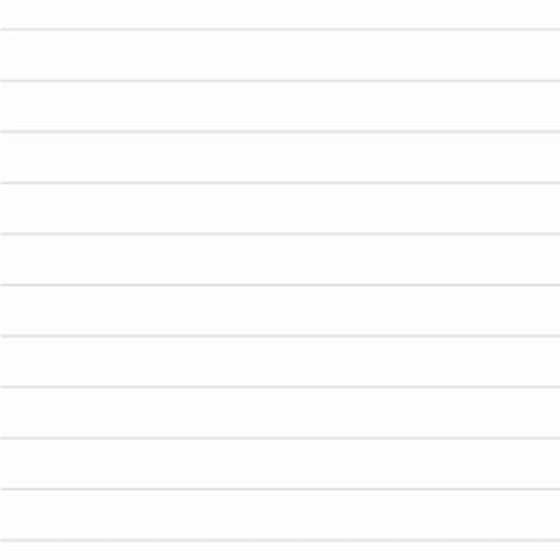

</div>
</div>

---

<style scoped>
.cols { display: flex; gap: 30px; align-items: center; }
.cols .left { flex: 2; font-size: 0.9em }
.cols .right { flex: 1; display: flex; flex-direction: column; align-items: center; }
.cols .right img { max-height: 400px; max-width: 100%; }
.cols .right .caption { font-size: 0.7em; margin-top: 8px; text-align: center; }
</style>

## Hack ideas: Academic & STEM learning

<div class="cols">
<div class="left">

- **Chemistry molecules**
  Reco molecular diagrams; provide structure + interpretation
- **Circuit simulator**
  Draw circuit diagram; simulate voltage/current behavior
- **Math Equation/Solver**
  Reco equations and use solver for step-by-step solutions
- **Physics Sim**
  Draw ramps, pulleys, pendulums; simulate motion & forces.
- **Kinematics Playground**
  Sketch objects; simulate motion-specific scenarios
  like friction, acceleration, and constraints.

</div>
<div class="right">

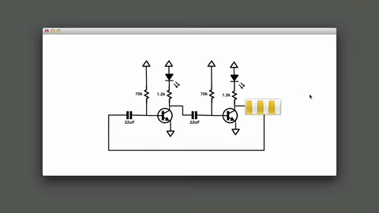
<div class="caption"><strong>Inventing on Principle</strong> by Bret Victor<br><a href="https://youtu.be/NGYGl_xxfXA">youtu.be/NGYGl_xxfXA</a></div>

</div>
</div>

---

<style scoped>
.cols { display: flex; gap: 30px; align-items: center; }
.cols .left { flex: 2; font-size: 0.9em }
.cols .right { flex: 1; display: flex; justify-content: center; }
.cols .right img { max-height: 600px; max-width: 100%; }
</style>

## Hack ideas: creative & other

<div class="cols">
<div class="left">

- **Sketch to video**
  Draw object, record prompt; animate object accordingly
- **Sheet music**
  Draw staff and place notes → playback
- **Image generation**
  Sketch turns into refined AI-generated imagery
- **3D model**
  Multi-view sketch becomes rotatable 3D object

</div>
<div class="right">


</div>
</div>

---

<style scoped>
.cols { display: flex; gap: 30px; align-items: center; }
.cols .left { flex: 1.8; font-size: 0.9em }
.cols .right { flex: 1; display: flex; justify-content: center; }
.cols .right img { max-height: 600px; max-width: 100%; }
</style>

## Hack ideas: domain-specific recognition

<div class="cols">
<div class="left">

- **Flowchart**
  Turn rough diagrams into executable logic or code flows
- **Mind map**
  Convert freeform nodes into structured interactive graphs
- **Architectural rendering**
  Plan/elevation generates full 3D environment
- **Floor plan editing**
  Import plan, sketch changes (walls, windows); update plan
- **Slide deck**
  Rough storyboard becomes polished presentation

</div>
<div class="right">

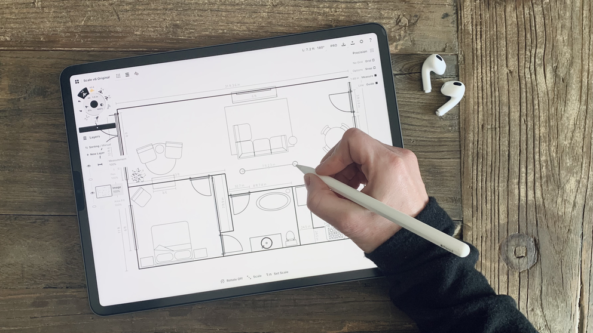

</div>
</div>

---

<style scoped>
.cols { display: flex; gap: 30px; align-items: center; }
.cols .left { flex: 1.5; font-size: 0.9em }
.cols .right { flex: 1; display: flex; justify-content: center; }
.cols .right img { max-height: 600px; max-width: 100%; }
</style>

## Hack ideas: app & UI generation

<div class="cols">
<div class="left">

- **Interactive UI prototype**
  Hand-drawn UI interactive with sketch aesthetic
- **App prototype**
  UI sketch to no-code working prototype
  Bonus: multi-platform Export
- **UI components**
  Reco buttons, forms, nav bars and make interactive

</div>
<div class="right">

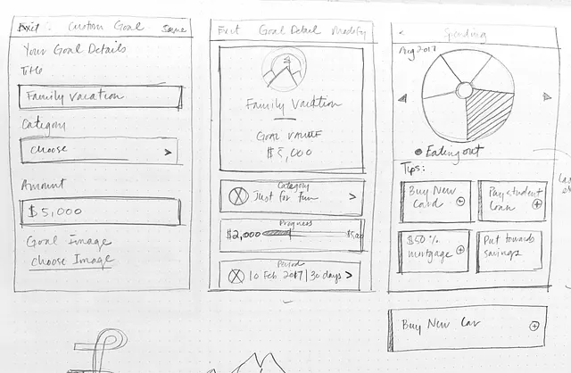

</div>
</div>

---

<style scoped>
.content { font-size: 0.9em }
.content li + li { margin-top: 12px; }
</style>

## Hack ideas: research challenges

<div class="content">

- **Tokenization**
  - Richer stroke representations using Bezier curves, B-splines instead of raw points
- **InkSight**
  - Reverse-engineer handwritten content from images back into editable strokes
- **Multi-writer models**
  - Train style-aware synthesis models to beautify or generate handwriting
- **Inkteractivity foundation model**
  - Suno for ink: recognize, create, and interact with everything you write or draw

</div>

---

<style scoped>
.cols { display: flex; gap: 30px; align-items: center; }
.cols .left { flex: 2.5; font-size: 0.82em }
.cols .left li + li { margin-top: 8px; }
.cols .right { flex: 1; display: flex; justify-content: center; }
.cols .right img { max-height: 600px; max-width: 100%; position: relative; top: -50px; }
</style>

## Research challenge: Tokenization

<div class="cols">
<div class="left">

- **Point-by-point is the norm**
  - [Cursive Transformer](https://arxiv.org/abs/2504.00051), [TrInk](https://arxiv.org/abs/2508.21098) tokenize each point as polar offsets
  - Works — but ~286 tokens/word, like spelling text one char at a time
  - Long sequences limit context window and slow inference
- **Bezier fitting ≈ byte-pair encoding for strokes**
  - Cubic curves: 4 control points capture what dozens of samples do
  - 2–8× compression: ~30 segments/word vs ~250 raw points
  - Loops and corners are hard — naive fitting shortcuts through them
- **Open questions**
  - Encoding the Bezier octet (8 floats) as discrete transformer tokens
  - Cumulative drift from autoregressive relative-coordinate generation
  - Whether compression gains actually improve generation quality

</div>
<div class="right">

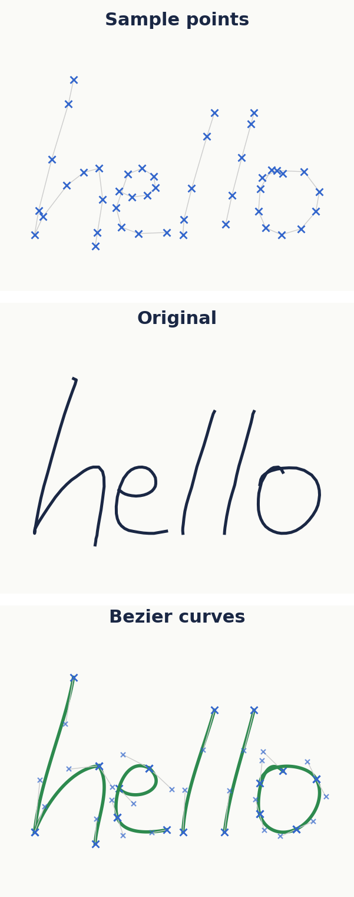

</div>
</div>

---

<style scoped>
.cols { display: flex; gap: 30px; align-items: center; }
.cols .left { flex: 2.5; font-size: 0.82em }
.cols .left li + li { margin-top: 8px; }
.cols .right { flex: 1; display: flex; justify-content: center; }
.cols .right img { max-height: 600px; max-width: 100%; position: relative; top: -30px; }
</style>

## Research challenge: InkSight

<div class="cols">
<div class="left">

- **Offline → online conversion**
  - Extract stroke data (x, y, pen state) from handwriting images
  - [InkSight](https://arxiv.org/abs/2402.05804) works well on clean, non-cursive, word-level crops
  - Full pages need OCR line detection first — imperfect today
- **Training data is the bottleneck**
  - Millions of handwriting images; almost no stroke-level datasets
  - Fonts = filled outlines, not strokes — need skeletonization
  - Quality-sensitive: blur, tilt, shadows, cursive joins all hurt
- **Open questions**
  - Scaling to cursive and connected scripts with high fidelity
  - Font skeleton → plausible stroke order, direction, and dynamics
  - Bridging the domain gap between synthetic and natural strokes

</div>
<div class="right">

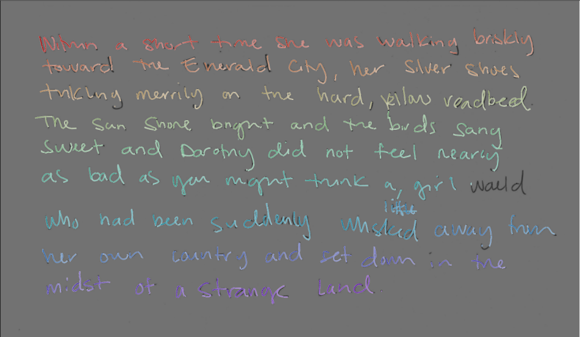

</div>
</div>

---

<style scoped>
.cols { display: flex; gap: 20px; align-items: flex-start; }
.cols .left { flex: 1.5; font-size: 0.82em }
.cols .left li + li { margin-top: 8px; }
.cols .right { flex: 1; font-size: 0.72em }
.cols .right table { width: 100%; border-collapse: collapse; margin-top: 4px; }
.cols .right th { background: #1a2744; color: white; padding: 4px 6px; text-align: left; }
.cols .right td { padding: 3px 6px; border-bottom: 1px solid #ddd; }
.cols .right tr:nth-child(even) { background: #f0ede4; }
.cols .right tr.sep td { border-bottom: 2px solid #1a2744; padding: 0; height: 0; line-height: 0; background: transparent; }
.cols .right .footnote { font-size: 0.8em; color: #666; margin-top: 6px; }
</style>

## Research challenge: Multi-writer models

<div class="cols">
<div class="left">

- **Style-aware synthesis**
  - Generate handwriting in any writer's style
  - Disentangle content (what) from style (how) in strokes
  - BRUSH: 170 writers, same prompt = direct comparison
- **Stroke beautification**
  - Make rough strokes nicer (stroke-to-stroke)
  - Preserve writer identity while improving legibility
  - Geometry problem, not pixels — work on polylines
- **Open questions**
  - Encoding style / teaching what "nicer" means
  - Matching local style variations (e.g. CAPS vs cursive)
  - Objective metrics for "nicer" handwriting

</div>
<div class="right">

**Datasets**

<table>
<tr><th>Dataset</th><th>Samples</th><th>Writers</th><th>Format</th></tr>
<tr><td><a href="https://fki.tic.heia-fr.ch/databases/iam-on-line-handwriting-database">IAMonDB</a></td><td>11.6K lines</td><td>198</td><td>dx, dy, pen</td></tr>
<tr><td><a href="https://zenodo.org/records/1195803">UNIPEN</a></td><td>117K segs</td><td>2,200+</td><td>abs x, y</td></tr>
<tr><td><a href="https://github.com/brownvc/decoupled-style-descriptors">BRUSH</a></td><td>27.6K</td><td>170</td><td>abs x, y, pen</td></tr>
<tr class="sep"><td colspan="4"></td></tr>
<tr><td><a href="https://drive.google.com/drive/folders/1wE9isVzXGj0s5n6BxY0r7h0JbxAqkdU-?usp=sharing">Ink AI 9K</a></td><td>9K words</td><td>1</td><td>abs x, y, pen</td></tr>
<tr><td><a href="https://drive.google.com/drive/folders/1wE9isVzXGj0s5n6BxY0r7h0JbxAqkdU-?usp=sharing">Ink AI 650K</a></td><td>650K words</td><td>1 (aug)</td><td>abs x, y, pen</td></tr>
</table>

<div class="footnote">

- IAMonDB = relative offsets
- UNIPEN = absolute + structural markers
- BRUSH & Ink AI = absolute + pen state
- Ink AI 650K split into A (323K) + B (324K)

</div>

</div>
</div>

---

<style scoped>
.content { font-size: 0.9em }
</style>

## Research challenge: Inkteractivity foundation model

<div class="content">

- **One model, full pipeline**
  - Suno = compose + arrange + perform + produce music. Do that for ink
  - Creation + interaction unified — no recognize-then-hand-off
  - Mixed pages: text, sketches, annotations, widgets parsed as one
- **Universal ink understanding**
  - Text, math, chemistry, diagrams, games — all from the same strokes
  - Structures become interactive: grid → game, circuit → simulation
  - Native gestures + context-aware: same mark adapts to surroundings
- **Learns from every stroke**
  - Adapts from corrections in real time
  - Style-preserving: generated content matches your handwriting
  - Data flywheel: every stroke and correction feeds back into the model

</div>

---

## Go build

- Clone the repo, `npm install && npm run dev`
- Pick an idea (or invent one)
- Implement the plugin interface — the HOWTO doc has every step
- We'll be here all day to help

**Show us something we haven't imagined yet.**
