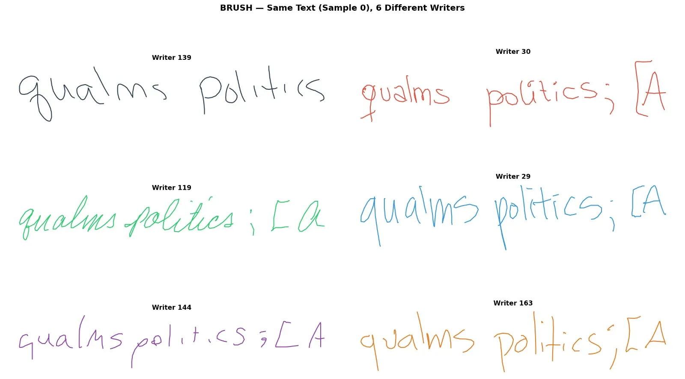
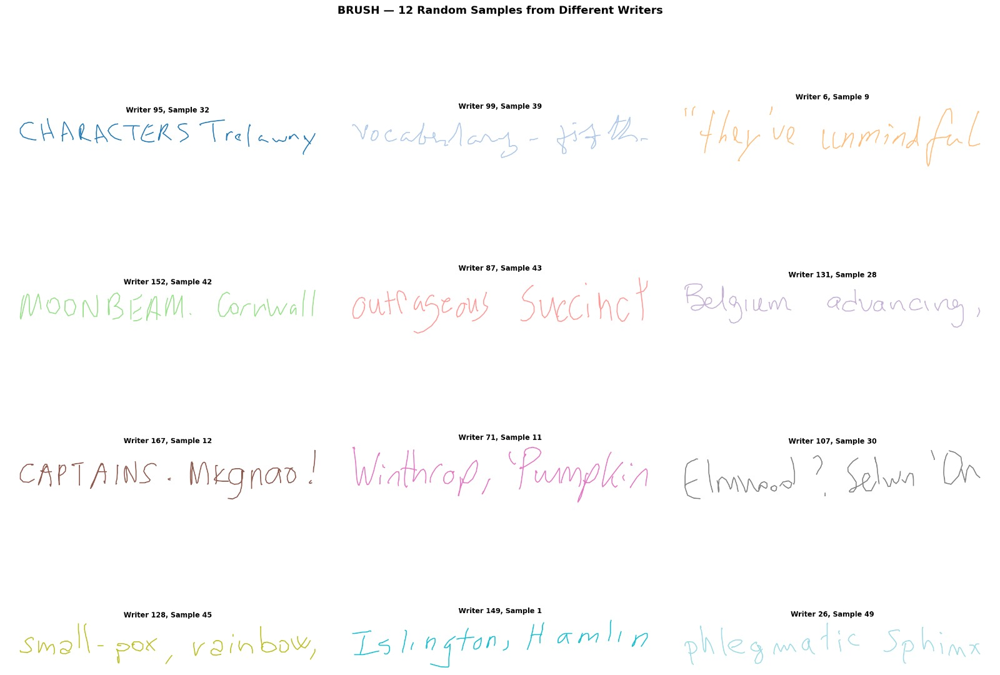
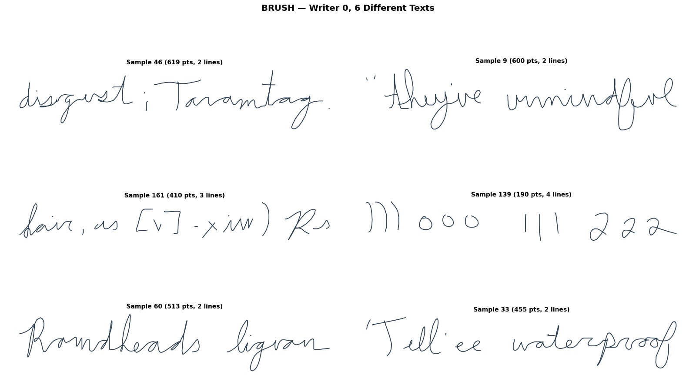
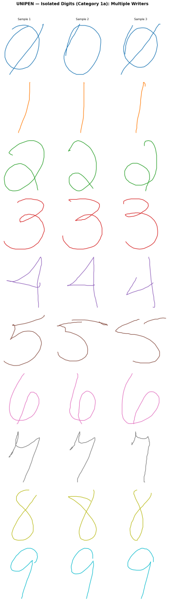
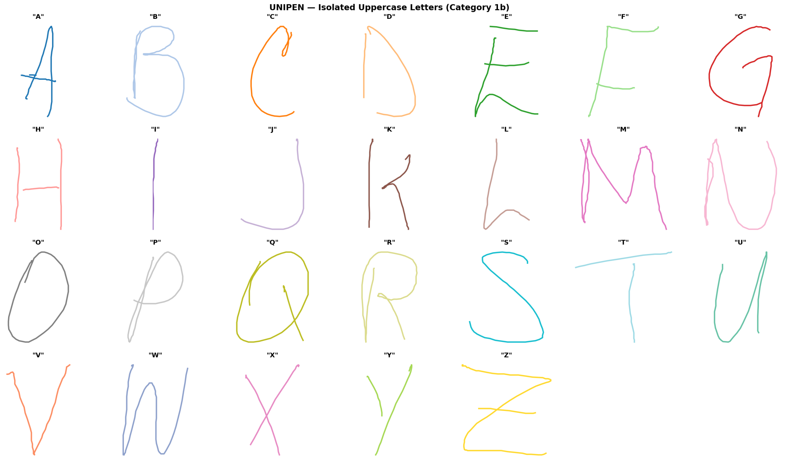
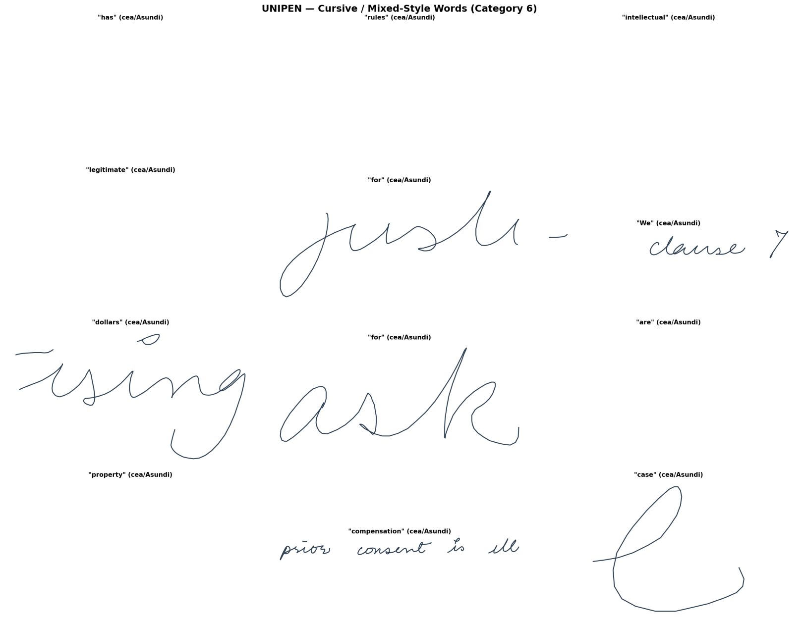
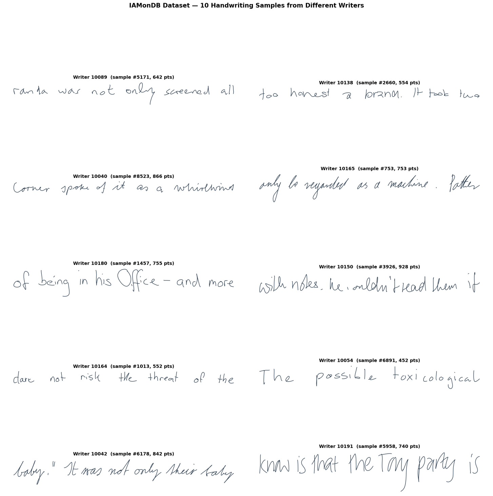

# Open Handwriting Stroke Datasets

This document catalogs three publicly available online handwriting datasets that capture pen-stroke trajectories (as opposed to static images). Each records sequences of (x, y) coordinates with pen-state information — the raw "how it was written," not just what it looks like.

All three cover English handwriting but differ in scale, granularity, and format:

| Dataset | Samples | Writers | Granularity | Format | License |
|---------|---------|---------|-------------|--------|---------|
| **BRUSH** | 27,650 | 170 | Multi-word prompts | NumPy `.npy` | Research use |
| **UNIPEN** | 117,415 | 2,200+ | Characters → free-form text | Text-based `.PEN_DOWN`/`.PEN_UP` | CC BY 4.0 |
| **IAMonDB** | 11,615 | 198 | Sentence-level text lines | NumPy `.npy` | Non-commercial (registration) |

---

## 1. BRUSH — Original Handwriting Dataset

### Overview

BRUSH contains **27,650 handwriting samples** from **170 writers**. It includes 166 unique text prompts, with 157 prompts written by 160+ writers each, enabling direct style comparison on identical content. The dataset is English-language, stored in NumPy `.npy` format, and available under a research-use license.

- Writing area: 120 × 748 pixels
- Resampled at 10 ms intervals for temporal consistency

### Statistics

| Metric | Value |
|--------|-------|
| Samples per writer | 160–166 (mean ~163) |
| Points per sample | 200–400 (76% of samples); mean 279 |
| Lines per sample | 2 lines (84% of samples); mean 2.6 |
| Strokes per sample | Mean 19.4 |

### Data Format

Each `.npy` file is a NumPy object array with the following structure:

| Index | Contents |
|-------|----------|
| `data[0]` | Absolute coordinates `[x, y, pen_state]` |
| `data[1]` | Offsets `(dx, dy, end-of-stroke)` |
| `data[4]` | Per-point character labels |
| `data[5]` | Pre-split stroke groups by text line |

- **Pen state**: `1.0` = start of new sub-stroke (pen-down after lift), `0.0` = continuation
- **Coordinate system**: screen convention (Y grows downward)

### Sample Visualizations

*Same text prompt (Sample 0) written by 6 different writers, showing handwriting style variation on identical content.*

*12 random samples from different writers, illustrating the diversity of prompts and writing styles.*

*Single writer (Writer 0) writing 6 different text prompts, showing intra-writer consistency.*

### Open Questions

- The shared-prompt design (157 prompts × 160+ writers) is uniquely suited for style disentanglement — can you separate *what* is written from *how* it's written?
- With character-level labels per point (`data[4]`), what can be learned about individual letter formation across writers?
- The fixed 10 ms resampling normalizes timing — is that a feature or a limitation for your use case?

### Links

- **GitHub (source)**: [brownvc/decoupled-style-](https://github.com/brownvc/decoupled-style-)

---

## 2. UNIPEN — Handwriting Dataset

### Overview

UNIPEN contains **117,415 handwriting segments** from **2,200+ writers** across 54 contributing institutions. It covers English (Latin alphabet) at multiple granularity levels: isolated characters, words, cursive words, and free-form text. The dataset is open source under **Creative Commons Attribution 4.0**, permitting commercial HWR training.

- Compressed size: 155.8 MB (`.tgz`)
- Coordinates are absolute (x, y) integers

### Category Breakdown

| Category | Description | Segments | Contributors |
|----------|-------------|----------|--------------|
| **1a** | Isolated digits (0–9) | 5,172 | 17 |
| **1b** | Uppercase letters (A–Z) | 10,211 | 17 |
| **1c** | Lowercase letters (a–z) | 14,447 | 20 |
| **1d** | Symbols & punctuation | 4,764 | 18 |
| **2** | Mixed-case isolated chars | 34,594 | 21 |
| **3** | Characters in word context | 13,514 | 8 |
| **6** | Cursive / mixed-style words | 15,539 | 35 |
| **7** | Words, any style | 16,612 | 35 |
| **8** | Free-form text (2+ words) | 2,562 | 27 |

### Statistics

| Metric | Value |
|--------|-------|
| Largest category | Mixed-case characters (Cat 2): ~34.6K segments |
| Word categories (6+7) | ~32K segments total |
| Points per word | 200–500 (mean ~324) |
| Strokes per word | Mean 4.5 |
| Characters per word | Mean 6.5 (cursive/mixed-style) |

### Data Format

- Text-based format using `.PEN_DOWN` / `.PEN_UP` directives for stroke boundaries
- Coordinates are **absolute integers** — no offsets or per-point pen_state flags
- No timestamp or pressure data — only X and Y per point
- Multi-stroke characters use hyphenated segment ranges (e.g., `260-261`)
- File structure: `data/` contains `.SEGMENT` definitions; `include/` contains stroke coordinates linked via `.INCLUDE`

> **Difference from IAMonDB**: IAMonDB stores `[dx, dy, pen_lift]` per point, while UNIPEN stores raw `X Y` coordinates with structural stroke markers.

### Sample Visualizations

*Isolated digits (0–9) from multiple writers (Category 1a), showing 3 samples per digit class.*

*Isolated uppercase letters A–Z (Category 1b), each rendered from a different contributor's stroke data.*

*Cursive and mixed-style word samples (Category 6) from the cea/Asundi contributor.*

*Free-form text sample (Category 8) showing a full sentence rendered from stroke coordinates.*

### Open Questions

- The multi-level hierarchy (isolated chars → words → sentences) invites curriculum-style approaches — does training on simpler categories transfer to harder ones?
- With 2,200+ writers and 54 institutions, how much geographic or demographic variation is captured, and does it matter?
- The text-based format needs parsing — is the overhead worth it, or is conversion to a tensor format a useful first step?

### Links

- **Zenodo (original)**: [zenodo.org/records/1195803](https://zenodo.org/records/1195803)

---

## 3. IAMonDB — IAM On-Line Handwriting Database

### Overview

IAMonDB contains **11,615 handwritten text-line samples** (sentence-level) collected from **198 writers**. The dataset covers 73 unique English characters and is available free for non-commercial research (registration required).

Each sample captures the full writing process as a sequence of pen movements with relative coordinate offsets.

### Statistics

| Metric | Value |
|--------|-------|
| Samples per writer | Mean 58.7, median 53 |
| Range per writer | 3–1,209 samples |
| Typical contribution | 30–70 samples per writer |
| Sequence length | 626–1,200 timesteps |
| Dominant range | 400–800 timesteps |

### Data Format

Stored as NumPy arrays with shape `(11615, 1200, 3)`, zero-padded to uniform length.

Each timestep contains three values:

| Channel | Description |
|---------|-------------|
| `dx` | Relative horizontal pen movement |
| `dy` | Relative vertical pen movement |
| `pen_lift` | `1` = pen up, `0` = pen down |

Files included:

| File | Contents |
|------|----------|
| `x.npy` | Stroke data `(dx, dy, pen_lift)` |
| `w_id.npy` | Writer IDs |
| `c.npy` | Character-level labels |

### Sample Visualizations

*10 handwriting samples from different writers, showing the diversity of sentence-level handwriting styles in IAMonDB.*

### Open Questions

- The relative-offset format (`dx, dy`) is immediately sequential-model-friendly — what's the simplest generative model that produces legible handwriting from this?
- Writer IDs + character labels are included — can you condition generation on both writer identity and text content?
- Zero-padding to 1,200 timesteps is convenient but wasteful for short samples — does variable-length handling improve results?

### Links

- **Official page**: [IAM On-Line Handwriting Database](https://fki.tic.heia-fr.ch/databases/iam-on-line-handwriting-database)
