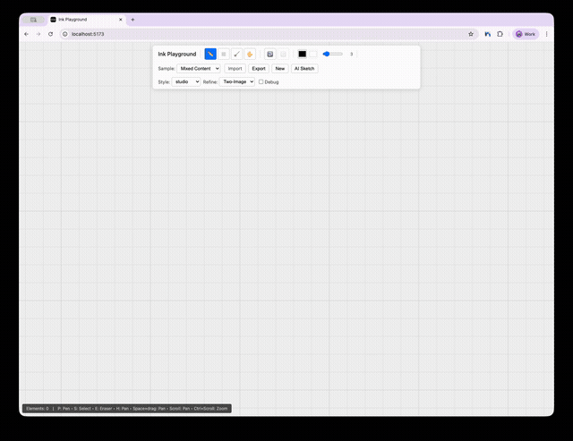

# Nonogram Puzzle Element

A [nonogram](https://en.wikipedia.org/wiki/Nonogram) is a logic puzzle where you fill cells in a grid to reveal a hidden picture. Each row and column has numeric clues indicating the lengths of consecutive filled runs — for example, a clue of `3 1` means that row has a group of 3 filled cells followed by a gap and then 1 filled cell.



## How to play

1. Write a word on the canvas (e.g. "cat")
2. Draw a rectangle around it, then draw an X through the rectangle
3. Select **Nonogram** from the palette menu
4. The word is recognized and used to generate a pixel-art image, which becomes the puzzle
5. **Tap** a cell to fill it, tap again to mark it (X), tap again to clear it
6. **Drag** through multiple cells to fill/mark them all at once
7. When the grid matches the solution, the cells colorize and a thumbnail of the original image appears

## AI image generation

By default, a built-in placeholder image (the text "INK") is used so the puzzle works without any API key.

To generate images from the recognized word using Gemini:

1. Get an API key from [Google AI Studio](https://aistudio.google.com/apikey) (requires a paid plan for image generation)
2. Create `.env.local` in the project root:
   ```
   INK_GEMINI_API_KEY=your-key-here
   ```
3. Restart the dev server

The prompt sent to Gemini is `"8bit pixel art of {word} centered on a white background, square image"`. The returned image is downsampled to a 10×10 grid to create the puzzle solution.
